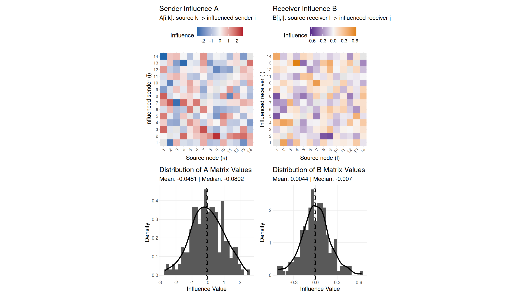

# sir

<!-- badges: start -->
<!-- badges: end -->

Social Influence Regression (SIR) for longitudinal network data.

## Overview

The `sir` package implements the Social Influence Regression model of Minhas &
Hoff (2025) for directed relational data observed over time. It explains
network **influence** -- lagged, model-implied channels through which one
actor's past behavior predicts another's future behavior -- using observable
covariates, via a bilinear (low-rank) regression.

The linear predictor is

```
eta_ijt = g(mu_ijt) = theta^T z_ijt + sum_{k,l} x_klt a_ik b_jl
```

where `a_ik = sum_r alpha_r W_r[i,k]` and `b_jl = sum_r beta_r W_r[j,l]` express
the sender/receiver influence matrices `A` and `B` through influence covariates
`W`. Equivalently `eta = theta^T z + (A X_t B^T)_{ij}`, and
`mu = g^{-1}(eta)`.

SIR estimates conditional temporal association unless your design justifies a
causal interpretation. Treat "influence" as a model term unless temporal
ordering, exogeneity of `W`/`Z`, unmeasured confounding, lag construction, and
the proposed intervention are defensible for the substantive question.

The main inputs play distinct roles:

| Input | Dimension | Role |
|-------|-----------|------|
| `Y` | `n1 x n2 x T` | outcome network (counts, continuous, or 0/1) |
| `X` | `n1 x n2 x T` | lagged signal that flows through influence (e.g. `log(Y_{t-1}+1) / infl_scale` for forecast-compatible count models) |
| `W` | `n1 x n1 x p` | sender-side influence covariates that parameterize `A` (and `B` for one-mode fits) |
| `W_recv` | `n2 x n2 x p2` | optional receiver-side influence covariates for full-bilinear bipartite fits |
| `Z` | `n1 x n2 x q x T` | exogenous dyadic covariates with direct effects (`theta`) |

## Installation

```r
install.packages("remotes")
remotes::install_github("netify-dev/sir")

# from a local checkout
install.packages("devtools")
devtools::install(".")
```

## Usage

```r
library(sir)

# simulate a small example (or use your own Y/W/X/Z, or data(icews))
dat <- sim_sir(m = 14, T_len = 80, p = 2, q = 2, family = "poisson", seed = 42)

fit <- sir(dat$Y, W = dat$W, X = dat$X, Z = dat$Z, family = "poisson", seed = 1)

ci <- confint(fit)             # cluster-robust by default when supported
coef_table <- data.frame(
  term = names(coef(fit)),
  estimate = round(unname(coef(fit)), 3),
  cluster_low = round(ci[, 1], 3),
  cluster_high = round(ci[, 2], 3),
  row.names = NULL
)
print(coef_table, row.names = FALSE)
#>         term estimate cluster_low cluster_high
#>       (Z) Z1    0.231       0.213        0.250
#>       (Z) Z2   -0.369      -0.379       -0.358
#>  (alphaW) W2    0.309       0.206        0.412
#>   (betaW) W1   -0.162      -0.176       -0.148
#>   (betaW) W2    0.115       0.110        0.121

mu0 <- predict(fit)             # fitted expected counts
W_scen <- dat$W                 # preserve the observed W structure
W1 <- W_scen[, , 1]
off <- row(W1) != col(W1)
W1[off] <- W1[off] + sd(W1[off], na.rm = TRUE)
W_scen[, , 1] <- W1
mu1 <- predict(fit, newdata = list(W = W_scen, X = dat$X, Z = dat$Z))
delta <- mu1 - mu0
scenario_table <- data.frame(
  baseline_mean = mean(mu0, na.rm = TRUE),
  scenario_mean = mean(mu1, na.rm = TRUE),
  mean_change = mean(delta, na.rm = TRUE),
  median_change = median(delta, na.rm = TRUE),
  p90_abs_change = unname(quantile(abs(delta), 0.9, na.rm = TRUE)),
  row.names = NULL
)
print(signif(scenario_table, 4), row.names = FALSE)
#>  baseline_mean scenario_mean mean_change median_change p90_abs_change
#>          1.129        0.4291     -0.7004       -0.6081          1.278

A <- fit$A                      # rows = influenced i, columns = source k
diag(A) <- NA                   # self-influence is not modeled
ord <- order(abs(A), decreasing = TRUE, na.last = NA)[1:5]
influence_table <- data.frame(
  source_node = ((ord - 1) %/% nrow(A)) + 1,
  influenced_node = ((ord - 1) %% nrow(A)) + 1,
  influence = round(A[ord], 3)
)
print(influence_table, row.names = FALSE)
#>  source_node influenced_node influence
#>            1              14    -2.682
#>            4              13    -2.592
#>            9               2     2.507
#>            3               7    -2.497
#>            2               1    -2.287

plot(fit, which = 1:4)          # influence heatmaps + distributions
```



`vcov(fit)`, `confint(fit)`, and `tidy(fit, conf.int = TRUE)` use
cluster-robust uncertainty by default for supported static directed fits. If a
fit cannot support analytic cluster-robust inference, the accessor errors
directly; use `boot_sir(fit, type = "dyad")` for full-bilinear bipartite fits.

The bundled `icews` dataset (50 countries x 95 months of inter-state conflict)
provides a larger real-data example:

```r
data(icews)
ifit <- sir(icews$Y, W = icews$W, X = icews$X, Z = icews$Z, family = "poisson", seed = 1)
c(converged = ifit$convergence, se_reliable = ifit$se_reliable)
```

See `vignette("sir_overview")` for a full walkthrough from simulation to
substantive interpretation.

## Estimation methods

- **Alternating GLM/IRLS** (`method = "ALS"`, default): alternates GLM/IRLS
  updates for sender and receiver influence. The `"ALS"` method name is retained
  for API compatibility.
- **BFGS** (`method = "optim"`): direct optimization of the full likelihood.

## Features

- Poisson, Normal, and Binomial families
- Directed one-mode, symmetric/undirected, bipartite/rectangular, and
  full-bilinear bipartite (`W_recv`) networks
- Static and dynamic (time-varying) influence covariates
- Cluster-robust inference by default for supported static fits; classical,
  HC0 sandwich, bootstrap, and jackknife inference remain available via
  `vcov()` / `boot_sir()`
- Model-implied scenario prediction via `predict(fit, newdata = ...)` and scenario
  helpers `get_scen_vals()` / `get_scen_array()`
- Network visualization via `plot_sir_network()`
- broom support: `tidy()`, `glance()`, `augment()` for modelsummary / tidyverse

## Reference

Minhas, S. & Hoff, P. D. (2025). Decomposing Network Influence: Social Influence
Regression. *Political Analysis*.
