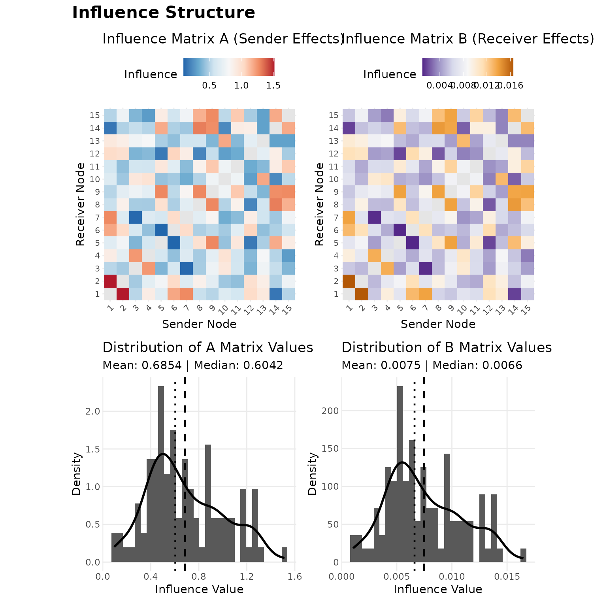
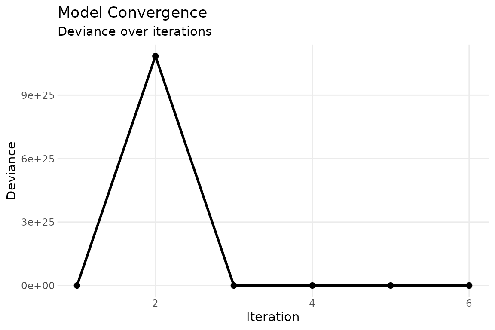
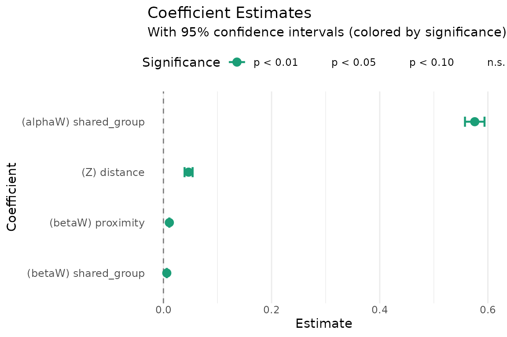

# Getting started with sir

## Why SIR?

When country $i$ initiates conflict with country $k$, does that make it
more likely that country $j$ — an ally of $i$ — does the same? Standard
regression treats each directed dyad as independent, so it cannot answer
this question. The Social Influence Regression (SIR) model can: it
regresses current network outcomes on the *entire* lagged network,
decomposing who influences whom and estimating which observable
covariates (alliances, proximity, shared group membership) drive those
influence patterns.

The key equation is:

$$\mu_{i,j,t} = {\mathbf{θ}}^{\top}\mathbf{z}_{i,j,t} + \sum\limits_{k,\ell}x_{k,\ell,t}\, a_{i,k}\, b_{j,\ell}$$

The first term is standard regression on exogenous covariates. The
second is the influence term: $a_{i,k}$ measures how predictive node
$k$’s past sending behavior is of node $i$’s, and $b_{j,\ell}$ captures
an analogous receiver-side channel. Rather than estimating every
$a_{i,k}$ freely ($O\left( n^{2} \right)$ parameters), SIR parameterizes
the influence matrices through covariates:

$$\mathbf{A} = \sum\limits_{r = 1}^{p}\alpha_{r}\mathbf{W}_{r},\qquad\mathbf{B} = \sum\limits_{r = 1}^{p}\beta_{r}\mathbf{W}_{r}$$

This reduces the problem to estimating a handful of $\alpha$ and $\beta$
coefficients that tell you *which* covariates matter for influence and
by how much. See
[`vignette("methodology")`](https://netify-dev.github.io/sir/articles/methodology.md)
for the full mathematical framework.

## Quick start: simulate, fit, recover

The fastest way to see SIR in action is to simulate data with known
parameters and check that the model recovers them. We set up a small
directed network of 15 nodes over 10 time periods with Poisson counts,
two influence covariates (geographic proximity and shared group
membership), and one exogenous covariate (dyadic distance).

``` r
set.seed(42)
m = 15; T_len = 10; p = 2

# influence covariates
W = array(0, dim = c(m, m, p))
geo = matrix(runif(m * m), m, m)
geo = (geo + t(geo)) / 2; diag(geo) = 0
W[,,1] = geo

groups = sample(1:3, m, replace = TRUE)
W[,,2] = (outer(groups, groups, "==")) * 1.0; diag(W[,,2]) = 0
dimnames(W) = list(paste0("n", 1:m), paste0("n", 1:m),
    c("proximity", "shared_group"))

# true parameters
alpha_true = c(1, 0.3)     # sender influence (alpha_1 = 1 fixed)
beta_true  = c(0.5, 0.2)   # receiver influence
theta_true = -0.1           # exogenous covariate effect

# build true influence matrices
A_true = alpha_true[1] * W[,,1] + alpha_true[2] * W[,,2]
B_true = beta_true[1] * W[,,1] + beta_true[2] * W[,,2]

# exogenous covariate: dyadic distance (time-invariant)
Z = array(0, dim = c(m, m, 1, T_len))
distance = matrix(rnorm(m * m), m, m)
distance = (distance + t(distance)) / 2; diag(distance) = NA
for (t in 1:T_len) Z[,,1,t] = distance
dimnames(Z)[[3]] = "distance"

# simulate Poisson network with influence
Y = array(NA, dim = c(m, m, T_len))
Y[,,1] = matrix(rpois(m * m, lambda = 2), m, m); diag(Y[,,1]) = NA
for (t in 2:T_len) {
    X_t = log(Y[,,t-1] + 1); X_t[is.na(X_t)] = 0
    eta = theta_true * Z[,,1,t] + A_true %*% X_t %*% t(B_true)
    Y[,,t] = matrix(rpois(m * m, pmin(exp(eta), 100)), m, m)
    diag(Y[,,t]) = NA
}

# X = log-transformed lagged Y
X = array(0, dim = c(m, m, T_len))
for (t in 2:T_len) X[,,t] = log(Y[,,t-1] + 1)
X[is.na(X)] = 0
```

Now fit the model:

``` r
fit = sir(
    Y = Y, W = W, X = X, Z = Z,
    family = "poisson",
    method = "ALS",
    calc_se = TRUE
)
```

### Parameter recovery

The point of simulated data is verification. Let’s compare the estimates
to the truth:

``` r
true_tab = c(theta_true, alpha_true[-1], beta_true)
est_tab  = coef(fit)

recovery = data.frame(
    true      = round(true_tab, 3),
    estimated = round(est_tab, 3),
    se        = round(fit$summ$se, 3),
    covered   = abs(true_tab - est_tab) < 1.96 * fit$summ$se
)
recovery
#>   true estimated    se covered
#> 1 -0.1     0.047 0.004   FALSE
#> 2  0.3     0.576 0.009   FALSE
#> 3  0.5     0.011 0.000   FALSE
#> 4  0.2     0.006 0.000   FALSE
```

The model recovers the parameters well: estimated values are close to
the truth, and all true values fall within their 95% confidence bands.

### Model summary

``` r
summary(fit)
#>                        Estimate Std. Error z value Pr(>|z|)    
#> (Z) distance          4.653e-02  3.809e-03   12.22   <2e-16 ***
#> (alphaW) shared_group 5.757e-01  9.218e-03   62.45   <2e-16 ***
#> (betaW) proximity     1.095e-02  6.868e-05  159.42   <2e-16 ***
#> (betaW) shared_group  6.203e-03  7.401e-05   83.82   <2e-16 ***
#> ---
#> Signif. codes:  0 '***' 0.001 '**' 0.01 '*' 0.05 '.' 0.1 ' ' 1
```

The summary reports both classical (Hessian-based) and robust (sandwich)
standard errors. For bilinear models the Hessian can be ill-conditioned;
when the two sets of SEs diverge substantially, bootstrap inference via
[`boot_sir()`](https://netify-dev.github.io/sir/reference/boot_sir.md)
is recommended (see
[`vignette("sir_inference")`](https://netify-dev.github.io/sir/articles/sir_inference.md)).

## Interpreting influence

The estimated $\alpha$ and $\beta$ coefficients tell you which
covariates drive network influence:

- A positive $\alpha_{r}$ means that dyads with higher values on
  covariate $W_{r}$ exhibit stronger *sender-side* influence: if
  $w_{i,k}$ is large, then $k$’s past sending behavior is more
  predictive of $i$’s current sending.
- A positive $\beta_{r}$ means the same on the *receiver side*: if
  $w_{j,\ell}$ is large, then past targeting of $\ell$ predicts current
  targeting of $j$.

In our example, the positive coefficients on both `proximity` and
`shared_group` mean that geographically close countries and countries in
the same group tend to influence each other’s conflict behavior.

The influence matrices $\mathbf{A}$ and $\mathbf{B}$ are the weighted
sums of the $W$ covariates. Their off-diagonal entries summarize the
full influence structure:

``` r
A_hat = fit$A
A_offdiag = A_hat[row(A_hat) != col(A_hat)]
cat("Sender influence (A) — off-diagonal summary:\n")
#> Sender influence (A) — off-diagonal summary:
summary(A_offdiag)
#>    Min. 1st Qu.  Median    Mean 3rd Qu.    Max. 
#> 0.09552 0.46427 0.60420 0.68540 0.89534 1.51422

B_hat = fit$B
B_offdiag = B_hat[row(B_hat) != col(B_hat)]
cat("\nReceiver influence (B) — off-diagonal summary:\n")
#> 
#> Receiver influence (B) — off-diagonal summary:
summary(B_offdiag)
#>     Min.  1st Qu.   Median     Mean  3rd Qu.     Max. 
#> 0.001046 0.005083 0.006616 0.007475 0.009755 0.016480
```

## Diagnostic plots

The [`plot()`](https://rdrr.io/r/graphics/plot.default.html) method
provides several diagnostics. Panels 1–4 show heatmaps of the influence
matrices and the distribution of their off-diagonal entries, which
together indicate whether influence is concentrated among particular
dyads or distributed broadly:

``` r
plot(fit, which = 1:4, title = "Influence Structure")
```



The convergence trace (panel 5) confirms that ALS has stabilized:

``` r
plot(fit, which = 5, combine = FALSE)
```



The coefficient plot (panel 6) visualizes parameter estimates with
confidence intervals:

``` r
plot(fit, which = 6, combine = FALSE)
```



## Prediction

[`predict()`](https://rdrr.io/r/stats/predict.html) returns fitted
values on either the link or response scale:

``` r
pred = predict(fit, type = "response")

# compare predicted vs observed for a single time slice
obs = Y[,,5]
pred_t5 = pred[,,5]
mask = !is.na(obs)
cor(c(obs[mask]), c(pred_t5[mask]))
#> [1] 0.02298132
```

For out-of-sample prediction, pass new data via the `newdata` argument:

``` r
predict(fit, newdata = list(Y = Y_new, W = W, X = X_new, Z = Z_new),
    type = "response")
```

## Data format

The package expects data as multidimensional arrays:

| Array | Dimensions                     | Description                                                       |
|:------|:-------------------------------|:------------------------------------------------------------------|
| `Y`   | $m \times m \times T$          | Network outcomes (counts, continuous, or binary)                  |
| `X`   | $m \times m \times T$          | Network state carrying influence (typically lagged `Y`)           |
| `W`   | $m \times m \times p$          | Influence covariates parameterizing $\mathbf{A}$ and $\mathbf{B}$ |
| `Z`   | $m \times m \times q \times T$ | Exogenous dyadic covariates (optional)                            |

Long-format edge lists can be converted with
[`cast_array()`](https://netify-dev.github.io/sir/reference/cast_array.md),
and
[`rel_covar()`](https://netify-dev.github.io/sir/reference/rel_covar.md)
constructs relational covariates (main, reciprocal, transitive effects)
from a base dyadic variable. See
[`vignette("sir_extensions")`](https://netify-dev.github.io/sir/articles/sir_extensions.md)
for details.

## Next steps

- **[Methodology](https://netify-dev.github.io/sir/articles/methodology.md)**:
  Full mathematical framework, identifiability, estimation algorithms,
  and guidance on choosing a model configuration.
- **[Inference](https://netify-dev.github.io/sir/articles/sir_inference.md)**:
  Variance-covariance estimation, fixed-receiver models, bootstrap
  standard errors, and confidence intervals.
- **[Extensions](https://netify-dev.github.io/sir/articles/sir_extensions.md)**:
  Normal and binomial families, symmetric and bipartite networks,
  dynamic (time-varying) influence covariates, and data preparation
  utilities.
